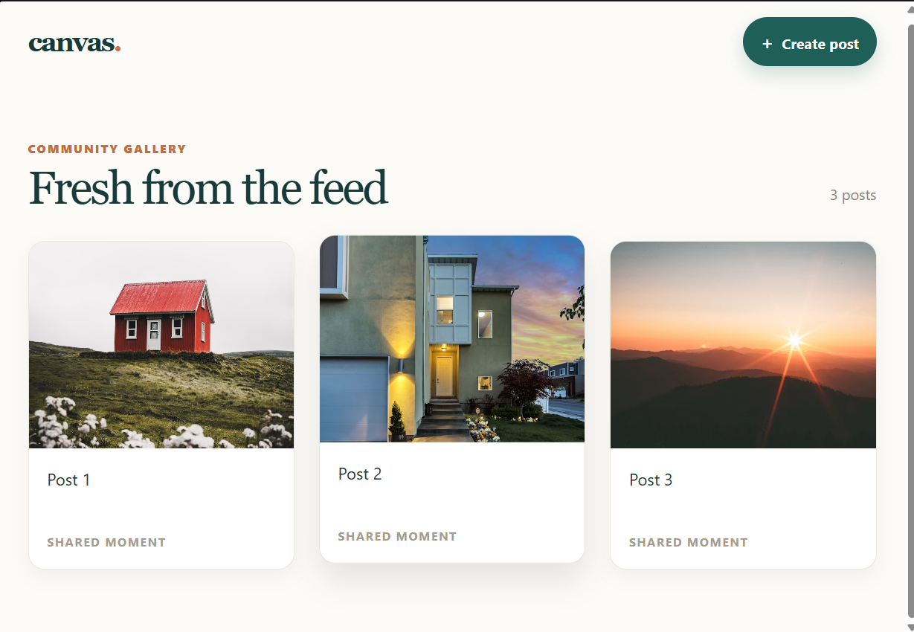
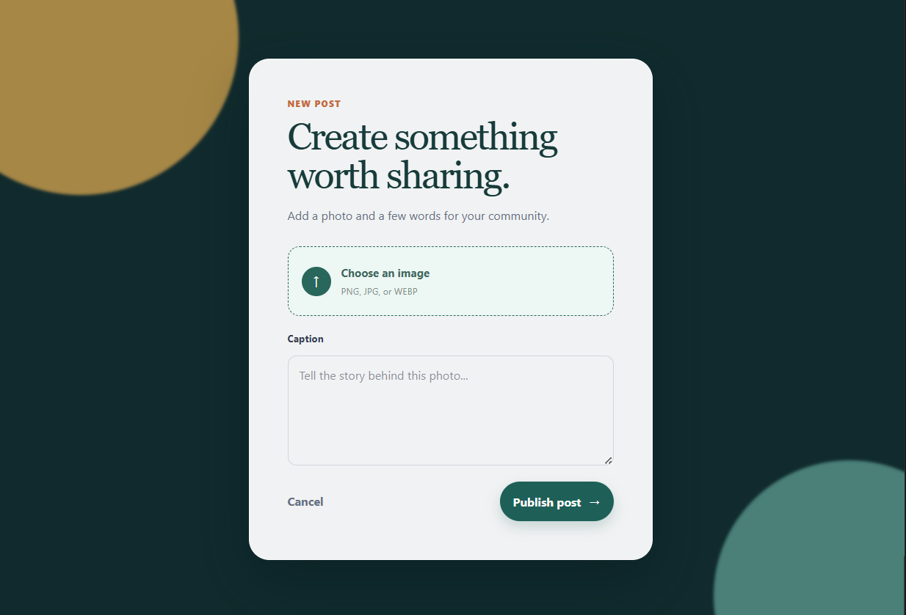

# Complete Backend

> Create something worth sharing.

A responsive social-style web application for browsing a community feed and publishing new posts with images and captions. The project is split into a decoupled frontend and backend, allowing a clean separation between the user interface and the application logic.

[](https://react.dev/)
[](https://vitejs.dev/)
[](https://nodejs.org/)
[](https://developer.mozilla.org/en-US/docs/Web/CSS)
[](https://developer.mozilla.org/en-US/docs/Web/JavaScript)

## Overview

This application combines a polished, mobile-friendly social gallery with an elegant post creation flow. Users can move between a feed view and a create-post experience while enjoying a modern UI, straightforward interactions, and a lightweight React-based architecture.

The project is organized as a monorepo-style workspace with two independent app folders:

- `backend/` handles server-side logic, API endpoints, and data persistence
- `fronted/` contains the React application, routing, and UI components

## Key Features

- Responsive social feed layout optimized for mobile, tablet, and desktop devices
- Branded navigation header with quick access to post creation
- Clean post grid with image cards, hover states, and polished content presentation
- Post creation panel with image upload support for common formats such as PNG, JPG, and WEBP
- Multi-line caption editor for expressive user-generated content
- Empty-state experience when no posts are available yet
- Lightweight Vite-based frontend for fast local development and production builds
- Clean, maintainable styling with custom CSS and reusable page-level structure

## Tech Stack

### Frontend

- React.js
- Vite
- React Router
- CSS3
- JavaScript (ES modules)

### Backend

- Node.js
- Express.js
- MongoDB with Mongoose
- Multer for file uploads
- CORS and dotenv support

### Development Tools

- npm
- ESLint
- Vite build tooling

## Project Structure

```text
complete-backend/
├── backend/
│   ├── src/
│   ├── server.js
│   ├── package.json
│   └── ...
├── fronted/
│   ├── public/
│   ├── src/
│   │   ├── assets/
│   │   │   └── ScreenShot/
│   │   │       ├── feed.png
│   │   │       └── create-post.png
│   │   ├── pages/
│   │   │   ├── Feed.jsx
│   │   │   └── CreatePost.jsx
│   │   ├── App.jsx
│   │   ├── index.css
│   │   ├── main.jsx
│   │   └── vite.config.js
│   ├── index.html
│   ├── package.json
│   └── ...
├── package.json
├── README.md
└── ...
```

## Installation and Setup

### 1. Clone the repository

```bash
git clone <your-repository-url>
cd complete-backend
```

### 2. Install backend dependencies

```bash
cd backend
npm install
```

### 3. Install frontend dependencies

```bash
cd ../fronted
npm install
```

### 4. Run the backend locally

```bash
cd ../backend
node server.js
```

This starts the API server, which is expected to serve requests from the frontend at `http://localhost:3000`.

### 5. Run the frontend in development mode

```bash
cd ../fronted
npm run dev
```

The Vite development server will open the app in your browser, typically at:

```text
http://localhost:5173
```

### 6. Build the production bundle

```bash
cd fronted
npm run build
```

This command compiles the React application into the `dist/` folder for production deployment.

### 7. Preview the production build locally

```bash
cd fronted
npm run preview
```

## Screenshots

The UI includes a feed gallery and a post creation experience designed to feel modern, social, and lightweight.

### Feed View



### Create Post View



## Usage Flow

1. Open the app in the browser.
2. View the community feed on the landing page.
3. Navigate to the post creation page using the quick action link.
4. Upload an image, add a caption, and publish the post.
5. Return to the feed to see the updated gallery.

## Notes

- The frontend and backend are intentionally separated to keep the application modular and easier to scale.
- The UI is already optimized for responsiveness and polished visual feedback.
- The project is well suited for future enhancements such as user authentication, profile pages, likes, comments, and richer media management.

## License

This project is currently distributed under the project’s existing package license and is intended for personal or educational use unless otherwise specified.

---

Built for a clean, modern social media experience with a focus on shareable moments and a smooth publishing flow.
